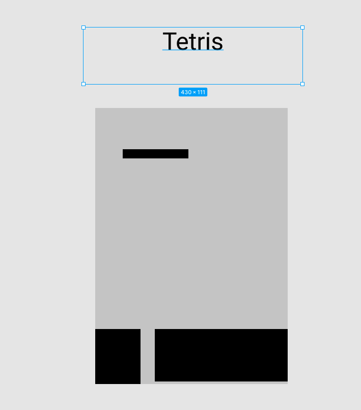

# SEI-Project-01

Make a game that I don't want to make.

## Tech used for this project.

-HTML
-CSS
-JavaScript

## MVP GOALS

-Render a Start Screen
-Render Game Screen
-Be able to spin blocks
-Keep track of score
-Show the next two pieces

## Stretch GOALS

-Add design to the game pieces
-Add design to backgrounds
-Increase difficulty
